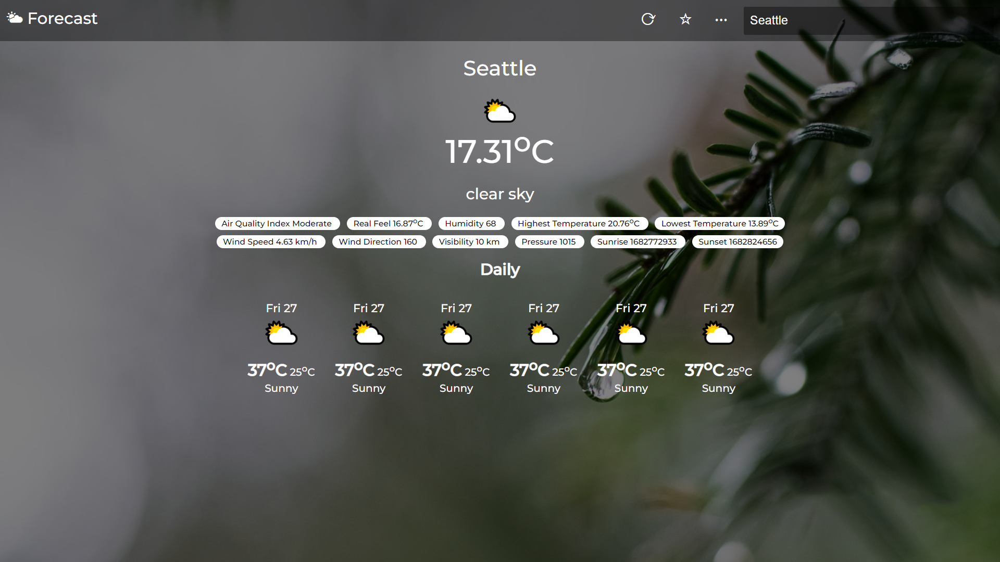
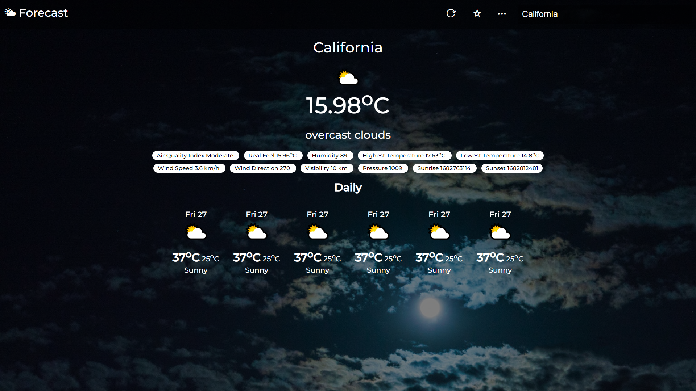
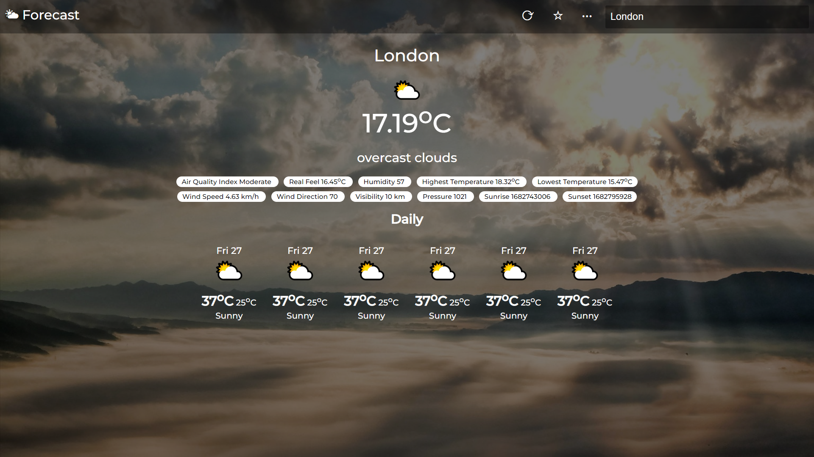

# 🌤️ Weather App using OpenWeatherMap API

Welcome to the **Weather App**! ☁️ This delightful little app is built using the OpenWeatherMap API and Vanilla JavaScript, bringing you the latest weather updates right at your fingertips!

## What Does It Do? 🤔
This app provides you with:
- **Current Temperature** 🌡️
- **Air Quality Index** 🌍
- **Real Feel** 🌈
- **Humidity** 💧
- **Highest Temperature** 🔥
- **Lowest Temperature** ❄️
- **Wind Speed** 🌬️
- **Wind Direction** 🧭
- **Visibility** 👀
- **Pressure** 🏋️
- **Sunrise & Sunset Times** 🌅🌇

## Screenshots 📸
Here’s a sneak peek of what the app looks like:

*The main dashboard showing current weather!*

Enjoy your weather journey! 🎉
Visit Website --> [WeatherAppUsingOpenWeatherMapAPI]

